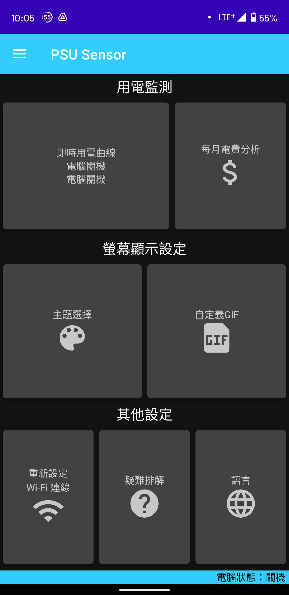
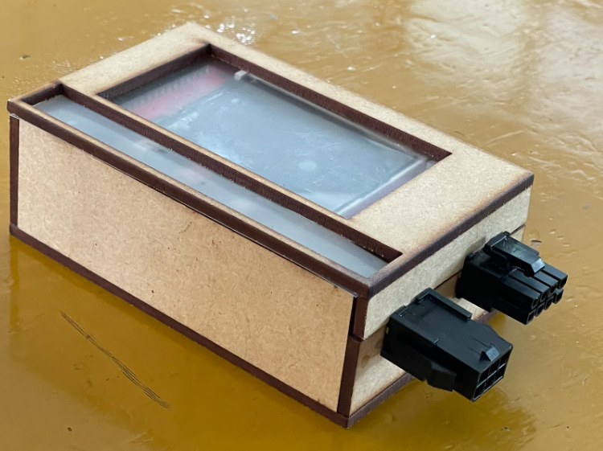
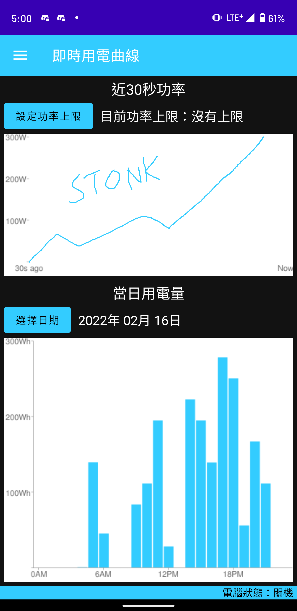
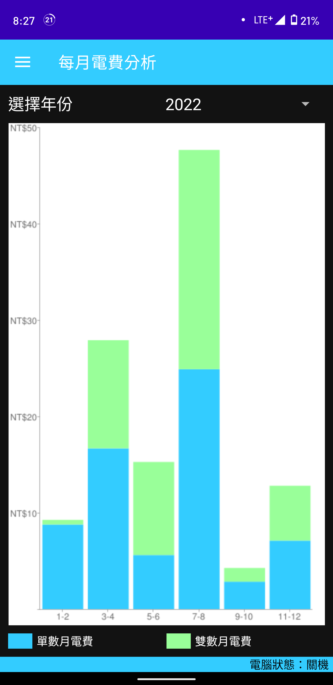
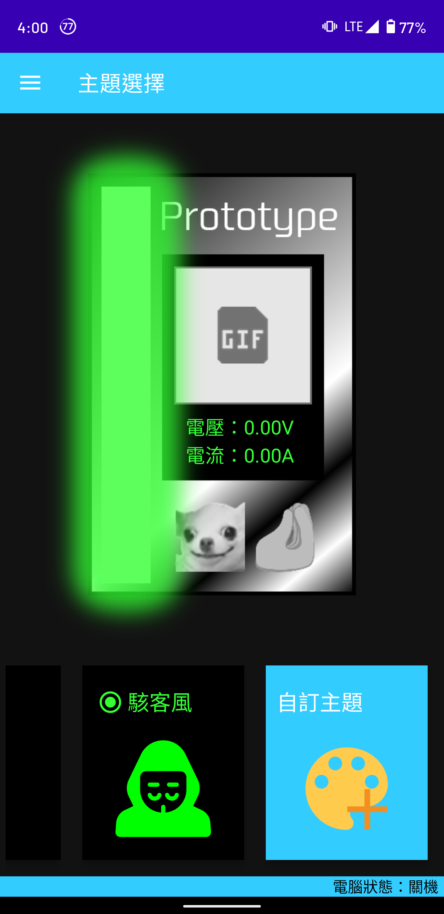
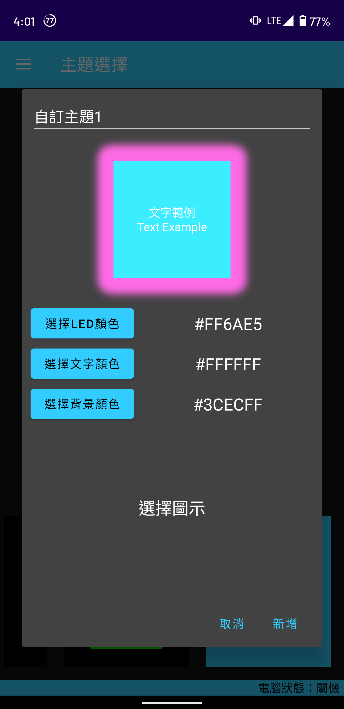

## unfinished

Read this in other languages: [中文-繁體](README.zh-tw.md)

This project is for a competition in my school. The concept and the title were conceived by the other team member, while I was in charge of the app.

P.S. My partner hasn't had a github account yet, so I can't add him as a contributor. (´;︵;`)

## Summary
It has two parts: **the app** on the phone and **PSU Sensor** (the one in the box)

After installing PSU Sensor in the place where it should be installed, setting up on the phone with bluetooth, you can just use it. EASY!

## Primary Functions
### Realtime Power Curve
* monitor the energy consumption of your computer instantly

### Monthly Electricity Bill Analysis
* calculate the electricity bill based on your power used

## Other Functions
### Theme Selection
* choose your favorite theme color
* you can customize the theme as well

### Custom GIF
* play the GIF whatever you like on the PSU Sensor

