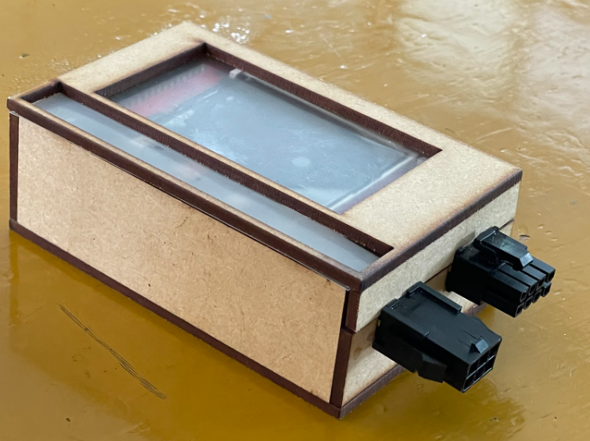
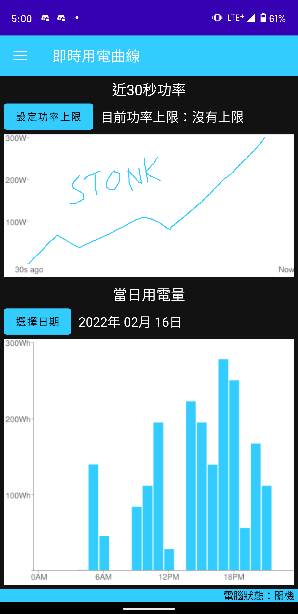
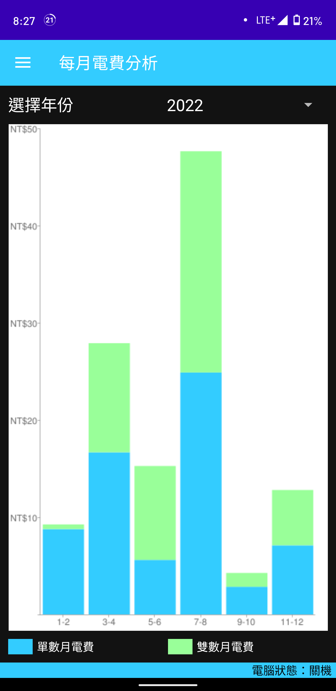
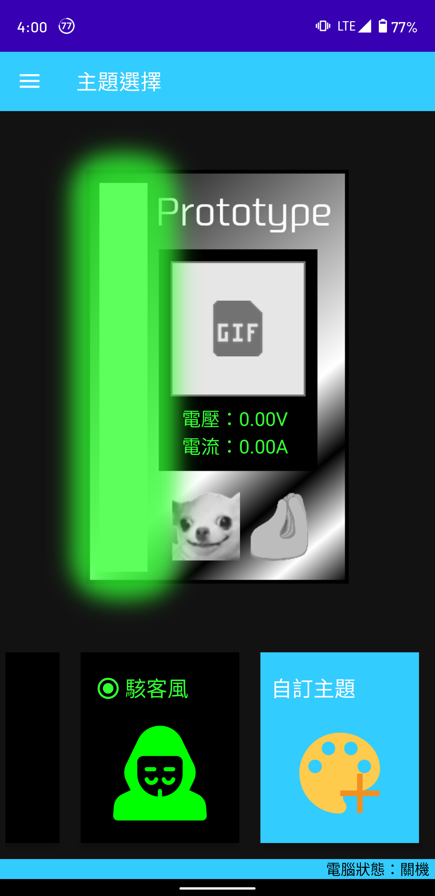

## 未完成

以其他語言閱讀：[English](README.md)

這是一個校內競賽的專題。概念和名稱是由另一位組員想的，而我負責 APP 製作。

P.S. 我的夥伴還沒有 github 帳號，所以我沒辦法把他加為貢獻者。 (´;︵;`)

## 簡介
這個項目可以分成兩個部分：手機上的 **APP** 和 **電競檢測儀** (用盒子裝起來的那個)

將檢測儀裝到該裝的地方之後，在手機上以藍芽設定完就可以使用了，簡單方便。

## 主要功能
### 即時用電曲線
* 即時監控你的電腦的耗能

### 每月用電分析
* 依據耗能來計算電費

## 其他功能
### 主題選擇
* 選擇自己喜歡的主題配色
* 也可以自訂配色

### 自定義 GIF
* 在裝置的螢幕上播放所選的 GIF

